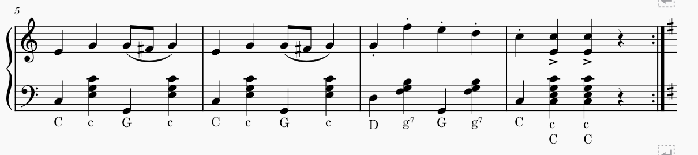

# The Pavia script

Pavia notation abuses traditional musical notation as a kind of
tablature that tells you what keys to press on a "Stradella system"
left hand accordion keyboard, rather than what notes will actually
sound.

It's very simple: any note with a chord type marking (one of the
characters M/m/7/d) denotes a chord key, and any other note is a bass
key. If the notes are written as a chord (with a single stem), the
marking is considered to apply to the highest note in the chord.

This script takes Musescore accordion scores in Pavia notation and
does two useful things to them:

* Make them sound the way they actually would on an accordion, which
  makes it easy to check for mistakes.

* Make them look like one of a number of conventional ways for writing
  out music for Stradella type accordions.

# Output formats

## "German" output format

The "German" output format writes out chords in full. It is, in fact,
produced (but hidden) even when you select one of the other output
formats, and used for playback.

Chord and note symbols below the staff are used to remove the
ambiguity in how to actually play the music. This is similar to the
way accordion music is usually published in Germany.

## "American" output format

The "American" output format is just the original Pavia notation,
which is unambigious to begin with, but with chord and note symbols
added for convenience. This is similar to American "AAA" style.

## "French" output format

The "French" output format shows only the right hand and the
chord/note symbol annotations. This is similar to the lead sheet
format in which French "musette" dance music is often published, but
with a little more detail.

The way this works, behind the scenes, is that the notes from voices 1
and 2 of the Pavia notation left hand staff are added to voices 3 and
4 of the right hand staff, and made invisible. The bass/chord symbol
annotations are attached to the invisible notes. This leads to
ambiguity if there are complex rhythms in the left hand, and it
discards any pre-existing notes from voices 3 and 4 of each staff.

# Possible future improvements

* It should be possible to produce strict AAA notation, though I don't
  see why.

* I know that in jazz music, people sometimes use several Stradella
  chord buttons in combination. I'd love to hear about notation
  conventions for that.

* It would be nice if this were a Musescore plugin rather than
  operating on files. I have tried this. The problem is that Musescore
  plugins, unless very carefully written, cause a lot of crashes. And
  the particular ways in which you have to be careful aren't
  documented very well.

  